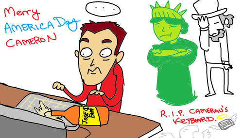

As has become a holiday custom, this Fourth of July in between cookouts I hoped on my computer and set to do some quick doodles for my buddies on Facebook. I post an initial image (like that above), and when people “like” it, I try to draw them a (somewhat) personalized holiday-related doodle. 

Part of the appeal for myself is to see how much I can throw together in 10 minutes using the limitations of Paint. The reaction was also pretty swell.

	
		

	

Also, I don’t usually do follow up doodles once I’ve called it a night but…

