Almost a year ago I was shown this map, made in 1937 by Hans Werner.

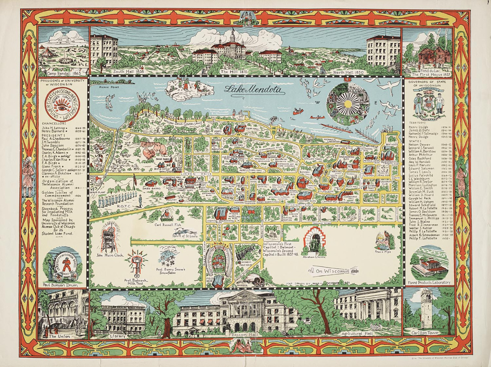
	<figcaption>You can see a larger version over at <a href="http://maphugger.com/post/40056792629/hans-werner-university-of-wisconsin-visitors">MagHugger</a> courtesy of Marty Elmer</figcaption>

Old maps like this one are intrinsically inspiring. The illustrations may be simple but the depth and variety of things to glance at makes it a fun playground for the eyes and imagination to fling across.

Nowadays, we don’t really see many of these. Which is understandable. It takes for-freakin’-ever to put together, and is also inherently more ‘artsy’ than straightforwardly informative. For my last Cartography class, and final class of my undergrad career, I decided to try to produce a modern version. 



I figured out right off the bat I wanted to do a few things:

- Make this large and engaging enough that in order to view it someone has to actively move their head,
- Give locations 'relative’ new names. There are plenty of services out there that tell you where particular buildings are on campus. “European Village Dorms” sums up those buildings far better than their given names.
- Make sure the labels/references made were something that 90% of anyone going to school here over the last three years would understand. 

Research mostly consisted of me just constantly bugging friends and colleagues for ideas. And I got quite a few! Thank you, everyone who responded.

Thank you, everyone.



I quite liked the layout of Mr.Werner’s map, particularly how it allowed for more intricate details in the sidebars. Originally, I had hoped to make this digitally, but a few problems arose.

First and foremost, keeping a sense of scale was near-impossible. As you can see I had started with the buildings, and despite efforts to draw them comparatively the same size, somewhere between the paper to screen the pen weights were noticeably different. When it came time to actually draw the map itself, I could hardly get past two buildings.

Secondly, when drawing digitally you can always zoom in for better detail. For something like this, where most buildings are going to just be rectangles (which absolutely works fine- relook at Werner’s map), it’s really hard to consistently draw that sloppy when you can instead make super-accurate (and therefore super time consuming and ultimately unnecessary) drawings that turn into uglier blobs when zoomed out.

Working digitally brought way to many hassles. Hassles, that would be non-existent if I just flat out drew the thing out altogether.



The project initially began by renting a projector and trying desperately to tape the 4’ x 3’ paper securely to the wall. Then, I projected google maps over the center and roughly sketched in all the streets. I in no way desired to measure out distances of streets, nor did I trust my hand to just figure it out as I went along. I still managed to goof up a few areas, but people have been kind to not point them out.

I don’t have any pictures of the set-up, unfortunately, but that’s mostly due to how I was constantly preoccupied getting it done quick or praying the tape wouldn’t fail. Again. And again.

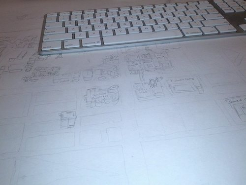

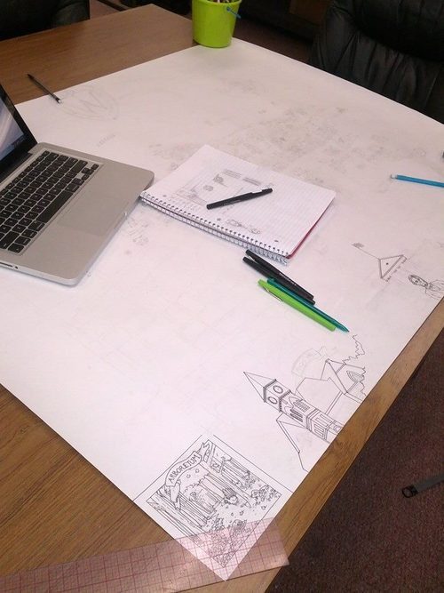

Eventually I summoned the courage to start drawing in pen. It’s kinda like diving into a lake in the morning- it's gonna be cold but if you just jump straight in you'll save yourself from endless trepidation.

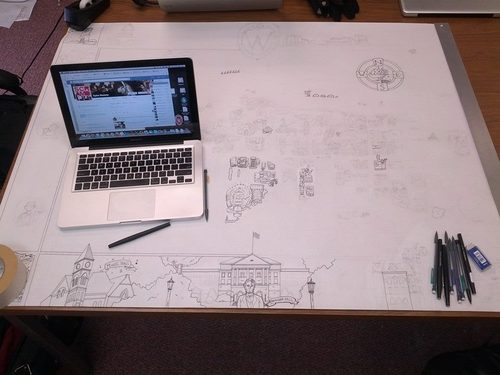

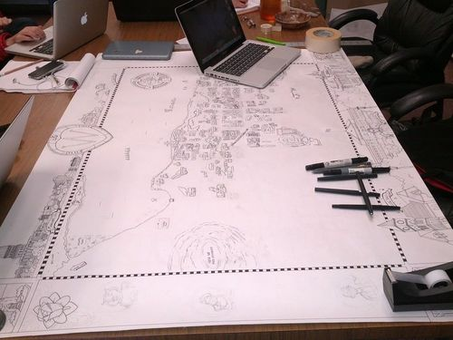

I should add a quick thanks to the folks at the Cart Lab who let me basically take over the main table in the lab to work on this. 

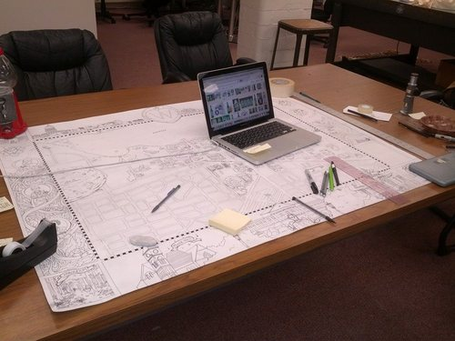

...and that’s 9 days working on it on and off. At this point- 3am the day the project was due- I sat back and considered what to write in the little box I’d left myself on the right-side.

Initially, I had planned to minimize the personal influence. Keep it subtle by dressing the vines with a few mementos of things and events that really had a lasting influence on me. Or that were just great memories.

Crediting people directly was something I was very conflicted with. On the one hand, you should always cite your sources. However, as I've learned when I tried to insert my editorial staff in a couple cover graphic for the paper, you always forget someone. It’s inevitable. They might be sketched in and missed when the final inking takes place, or completely slip the mind because that’s what minds do. 

By 6am I decided 9 days of work is enough justification for some self-indulgence.

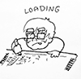

Just before submitting the project in, I took a few post-it notes and made a little gif for the loading image. Seemed fitting.



…it's not quite done though. Needs something… 

John Cusack?

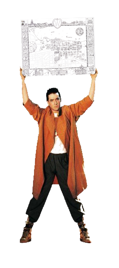

No. Not Cusack. Not this time.

Color!



I do hope, eventually, to sit down with a small armada of colored pencils, acrylics, watercolor, and pastels and wage war on the original document- but for now I’m far more skilled with photoshop. I am a addicted to the almighty strength of the “layers” and “Hue/Saturation” tools. 

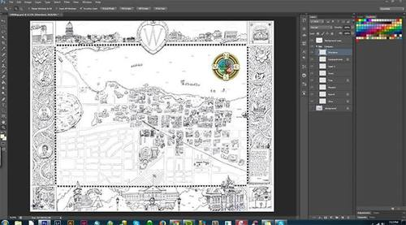

In order to do the coloring I re-scanned the map, opened it in photoshop, and immediately put the scanned copy on the top layer. Setting that layer to Multiply allows you to treat it as a coloring book. 

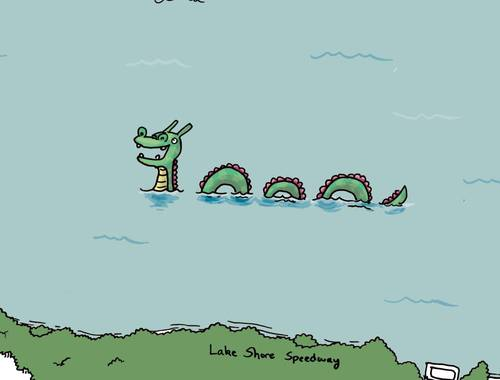

I don’t have as many shots of this, but I do have a screenshot of the happy Mendota Monster. 

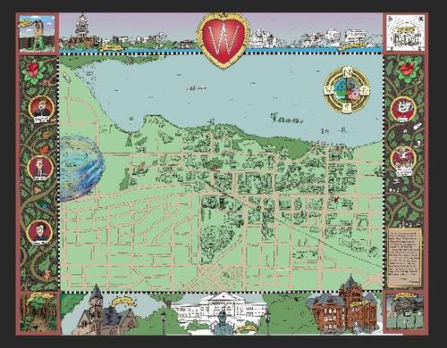

After quite awhile of tinkering, I eventually got the base colors more or less down. Everything goes much faster once that’s done, because everything is separate layers.

Figuring out what colors to use for the roads and ground took forever. 

I added a few things to help fill in the massive blank space. There’s still a massive blank space, but there’s a cute menagerie of critters in close proximity to draw the eye away now. 



It’s worth mentioning that my home desktop is a beast. Despite the stupid large size of the file at no point did I experience any lag, which is amazing. 

That said, my computer did try to voice it’s frustration with me a few times though.

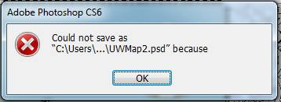

It also refused to save due to scratch drive space on me right about when I’d finished. When I went to fix this, Photoshop rebelled by self-terminating. 

Luckily I’d saved half an hour prior. Save often friends.

Finally, getting the printer to accurately print the map was a bit of a struggle. We at the Cart Lab are not printers, we are people who make maps that occasionally need to print something.

After jumping between two computers, Arthur Robinson (our name for the large-scale printer) finally acknowledged my wish to print. 

Unfortunately it decided to clip quite a large part of the bottom off.

It took another two tries, but eventually it came out right.



	
	<figcaption>Viola!</figcaption>

	
		

	

I’m really happy with how this turned out. The captivated searching done by my roommates when I got back was validation of a “mission accomplished”. It’s a good day, to be sure.
