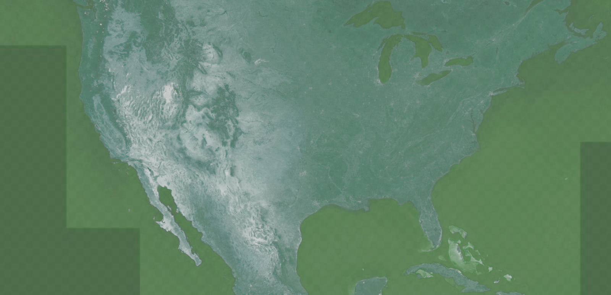
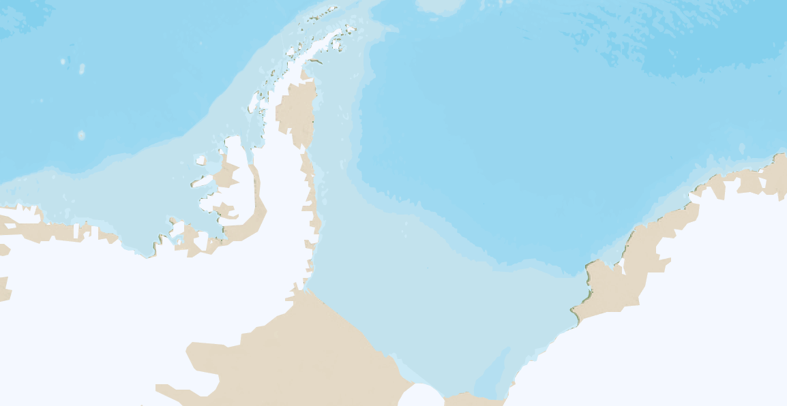
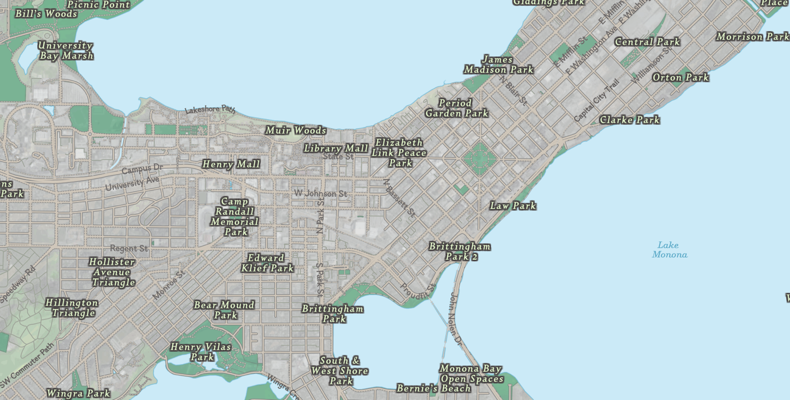

I put together a map for National Geographic!

NG came to DevelopmentSeed with a project called <a href="http://education.nationalgeographic.org/programs/love-your-park/" target="_blank"> Find Your Park, Love Your Park</a>, part of the Yellow Rectangle's celebration of the National Park's centennial. The idea was that folks could locate a park and make a pledge to do something nice for it.

It was fun to put together, and highlighted a lot of the limitations of Mapbox Studio Classic & OpenStreetMap.

<div class= "full-bleed">
	<div id="map"></div>
</div>

<fig>Map produced for Love Your Park, Find Your Park. Fonts have been changed.</fig>

<style>
	.full-bleed{
		margin:2em 0 1em;
		height: 350px;
	}

	#map{
		width:100%;
		height: 350px;
		position:absolute;
		left:0;
		border: solid 1px #888;
	}
</style>

<script>
	addMap();

	function addMap () {
	  const token = 'pk.eyJ1IjoiZG1vcmlhcnR5IiwiYSI6Ikd3T29EOWMifQ.-DKJ4ernht84AZmc6Bk51Q';
	  const basemapUrl = 'https://api.mapbox.com/v4/dmoriarty.da4680b3/{z}/{x}/{y}.png';

	  // Initialize map
	  const map = L.map('map',
	    {zoomControl: true}).setView([40.36, -100.55], 3);

		L.tileLayer(basemapUrl + '?access_token='+token, {
		    attribution: 'Map data &copy; <a href="http://openstreetmap.org">OpenStreetMap</a> contributors, <a href="http://creativecommons.org/licenses/by-sa/2.0/">CC-BY-SA</a>, Imagery © <a href="http://mapbox.com">Mapbox</a>',
		    maxZoom: 20,
		}).addTo(map);

	  // Disable drag and zoom handlers.
	  map.scrollWheelZoom.disable();
	};
</script>

I
Love Your Park


What was super exciting about this opportunity was that it was something _new_ for NG. They have design nailed down when it comes to beautiful <span class="tooltip">small scale maps<i class="fa fa-info-circle fa"></i><span class="tooltiptext">World view; A map scale that shows a relatively large area on the ground with a low level of detail.</span></span>, but they don't really have a standard for the <span class="tooltip">large scale maps<i class="fa fa-info-circle fa"></i><span class="tooltiptext">City/street view; A map scale that shows a small area on the ground at a high level of detail.</span></span>. This meant I had a lot of relative freedom in what that would look like, and how to scale it down from the distinctive style NG is so well known for.

The goal was to show every park in the United States, and make the distinction between National & local parks. To ensure the map didn't look like a jumbled mess of green polygons, we knew early on we'd need the parks to come slowly depending on how far the user was zoomed in.

There are a few options for styling a basemap, but I went with <a href="https://www.mapbox.com/">Mapbox Studio Classic.</a>

II
Boxing up that map


Mapbox Studio takes data from OpenStreetMap and lets us style it using CartoCSS. 

Let's unpack that.

<a href="https://www.openstreetmap.org/">OpenStreetMap</a> is a wikipedia-style dataset of the world. Anyone can contribute and anyone can use the data from it. 

Included in the dataset is <span class="tooltip">everything geographic<i class="fa fa-info-circle fa"></i><span class="tooltiptext">Roads, rivers, boundaries, buildings, parks, etc. Anything you can map could (and likely is) be part of OSM.</span></span> of which a lot has metadata for place names, type, function, or use. Because anyone can edit it, this metadata is an absolute mess, but it's there all out in the open to parse through.

Mapbox hosts a filter of OSM data on their own servers. This means we don't need to wrangle with the <span class="tooltip">original massive dataset<i class="fa fa-info-circle fa"></i><span class="tooltiptext">617 GB uncompressed!</span></span> saving us much time and many headaches. Bless their hearts <i class="fa fa-heart fa" style="color:red"></i>.

Through their Studio service, we can then target those OSM elements with CartoCSS. That is, we can say something like: ```#roads{ stroke-color: red }``` and all elements in the dataset that are tagged as 'roads' will be colored red. It's rad.

III
Let's Style the World


I decided to start the project from the ‘known’ small-scale view. National Geographic’s style has a few qualities:

- Pseudo-realistic terrain color
- Subtle elevation on land & bathymetry for water
- Densely labeled with their stock of fonts

Almost all Mapbox maps are based on vector data, which leads to a nice but discrete terrain shading. They have a Land cover data layer that lets you style separately woods, scrub, grass, crops, & snow- but I wanted to have something more continuous and smooth. 

To achieve the continuous look, I turned primarily to their satellite & hillshade data layers. The hillshade layers worked to help punch out the elevation data, while the satellite layer at a low opacity helped mask the discrete borders and give it a much more realistic tone.

<div class="images"><fig>Layer stack for the map</fig></div>

The satellite layer is very saturated & dynamic. Much to strong for my purposes. Following an example  <span class="tooltip">AJ Ashton<i class="fa fa-info-circle fa"></i><span class="tooltiptext">AJ is the lead Cartographer at Mapbox. <a href="https://github.com/ajashton">He does really cool stuff</a>, and was nice enough to lend some advice while I worked on this. Thanks!</span></span> did in the style <span class="tooltip">Satellite Afternoon<i class="fa fa-info-circle fa"></i><span class="tooltiptext"><a href="https://github.com/mapbox/mapbox-studio-satellite-afternoon.tm2">You can view this style on Github</a>, or pop check it out in Mapbox Studio Classic from the default list they provide.</span></span>, I used their image-filter to achieve a natural look. 

<div class="images"><fig>Satellite layer hue shifted to green tones.</fig></div>

<div class="images"><fig>Added background color underneath the satellite layer, & bathymetry layer above to cover the toxic looking water.</fig></div>

<div class="images"><fig>Added MB hillshade for terrain shading & color on top to dilute the darker areas. Lookin' good!</fig></div>

One downside to this method is that it requires the satellite image to be layered over with a ```multiply``` composite. This makes the white areas see-thru, and we end up with weird looking cold places. One solution is to simply use the MB land cover layer to target areas with the ```snow``` tag, but...

<div class="images"><fig>Antarctica enjoying some long sandy beaches</fig></div>

Even then it's not perfect. With some more GIS work the water layer could be made to match up with the snow area to cover it up. However, this map was only meant to show the United States... so we could just bound the map's view to non-arctic areas and deal with this at a later time.

IV
City View, and Everything in Between


For the large scale there was a lot of freedom, but there was a looming restriction in that it needed to fluidly flow from top down. Initially I had hoped to have the satellite kick in to full as the user zooms in, but tests with that proved really awkward. Satellite imagery is a ‘all there or barely noticeable’ kind of feature. Because I was using it so lightly initially, to shift to a full view would require large steps with the between zoom layers in both color & opacity.  

From testing out a few options, just having the sat imagery stay faint as we zoomed in seemed to be the better alternative. From that point, I made a pleasant simple view at the lower levels of warm brown roads with a light green tinted satellite base layer beneath it.

<div class="images"><fig>Lovely little city called Madison</fig></div>

Another option would have been to show OSM data for buildings. We decided against that due to the fact that OSM is <em>very</em> incomplete for buildings, and it would be worthless for smaller towns.

To achieve the fade out of the terrain layers, the flat layer above the satellite imagery gets stronger in opacity as the user zooms in. To help the color flatten, the sat imagery also gets completely desaturated. There are still a few jumps zooming in where the color difference shifts from the yellowish-green to a more aqua-green, but overall the experience is fluid enough where I don’t believe that’ll stick out.

V
To Be Continued...


Another hefty portion of this project was the data wrangling side of things. Essentially, OSM metadata is a mess, and styling National Parks different from regular parks is an enormous pain. How did we get around that? Why we did our own extract on OSM pulling out the data for every single park in America. Oh boy!

That process and frustration will be saved for another blog post.

Cheers!
