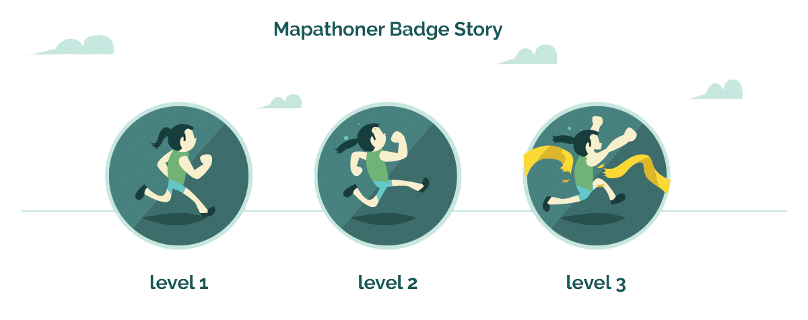



OpenStreetMap is amazing, but it's only as good as we make it.

Over the last Winter I had the pleasure to lead out design for Missing Maps- an effort to create and foster a community around mapping missing features in OpenStreetMap. To quote Missing Maps,

"While major cities are mapped extensively, many towns are only marked by their roads. Still many places are literally 'missing' from any map, and when a disaster strikes those regions first responders lack the information to make valuable decisions regarding relief efforts."

The organization is led by the <a href="https://hotosm.org/">Humanitarian OpenStreetMap Team (HOT)</a> and supported by The American Red Cross.



Mapping the world in OpenStreetMap is a repetitive, seemingly endless and often thankless task. We aimed to solve the monotony of editing OSM by adding an element of play on the site by offering users frequent rewards in the form of online badges. Yes yes, gamification. 

We built out three parts:

- Leaderboards for HOT projects that highlight the top contributors in each project, and allow you to compare multiple projects.
- User profiles to show stats for each person's contributions, and reward em' with badges based on their contributions.
- and finally a hub for MissingMaps events & news.



One of the primary entry points for OSM mapping are Mapathons. These are locally held events in which a bunch of people show up, get on computers, and trace some imagery. Often involving pizza.

The hardest technical lift for this project was getting the live data stream set up for each user's edits. In preparation, we actually built out a couple of 'test runs' to see how the system would hold up during a real Mapathon. The first of these was *Trending OSM Hashtags*.

</img>
<figcaption>{% include bits/tooltips.html face="Why the #'s? I promise we're not just jumping on the twitter bandwagon." longtext="Well, OSM, like most tech older than ten years, is an aged beast. The initial developers are still involved, but OSM isn't the bread-winning job for most of them. Making major changes to the infrastructure requires much more work than anyone presently has the time or money to do. The hashtags are inserted into the comments section of each edit & make them scrap-able. It's not a feature, it's a hack. But it works!" %}</figcaption>

Following this and a few other proof of concepts, we ventured into building out the site.





We felt good about the original copy on the landing page, but wanted to better frame and dole it out. 







One major component of the Missing Maps upgrade was adding [user pages](https://developmentseed.org/blog/2016/06/09/mm-badges) to the site. If you edit OSM for Missing Maps, you automatically get one! 

	<a href="http://www.missingmaps.org/users/#/1784968">
		</img>
	</a>
	<figcaption>As you can see I've mapped just a lil' bit of buildings.</figcaption>

The main goal for the user pages was to clearly and nicely layout contribution statistics. We list out what projects folks have been a part of, give a little calendar for when they contributed, and a map of _where_ they mapped

Through these pages we also award badges.

By providing a badge or similar reward for doing small tasks within OSM, we both provide a ‘light at the end of the tunnel’ and immediate positive feedback. These tasks can also be utilized to steer our users towards mapping 



</img>

I wrote a bunch of words on this on [Development Seed's blog](https://developmentseed.org/blog/2016/06/09/mm-badges), but I'll do a tl;dr version here. My first iterations on the badge design was much like the center one here:

To begin, we brainstormed with the American Red Cross to determine which metrics we wanted to incentive- do we want to encourage people to map only the areas they're familiar with? Can we possibly steer these folks towards more advanced mapping techniques with badges?

Once we had a few ideas, we researched other badge systems and tried to pin-point where they succeeded or faltered. All in all the ones that worked well were friendly, distinct, & just geometric enough to look polished.

</img>

...but we wanted these to be in a style that was easily replicated. Doing a flat style worked pretty great for that, and has been fairly successful with the Red Cross making their own versions of the graphics for other parts of the site & media.

</img>

One thing we settled on pretty early in designing these were that for the badges levels should tell a story of sorts. This inherently binds badges of the same category together, and provides a little extra intrigue into what the next badge is gonna be.



The final component of the Missing Maps update was building out leaderboards that update live~*. This serves as a tool to use during events themselves to let people 'race' each other to see who can contribute the most. It also provides a quick means of identifying super users.

This was the part that saw the most iterations, as we tested it out multiple times before officially launching the tool.

</img>

The above are screenshots from the various iterations, each deployed at various Mapathons. The final layout differed quite a bit from this as we optimized the layout for comparing events to one another.

</img>



Within two weeks of the launching the new Missing Maps site, a translation feature was added by someone entirely unconnected to the project. Someone in the OSM community noticed that being able to translate the site into French/Spanish/etc. would be incredibly useful for mapping efforts in those countries, and went ahead and built it out. In a similar fashion, MissingMaps has also added a blog section, a stats overview page, & upgraded a few sections we originally built.

That sort of gumption was only possible because we built the whole thing Open Source. All the code for the Missing Maps website & the API that fuels the database are [checked out via Github.](https://github.com/missingmaps)

To see the rest of the MissingMaps badge collection, [become a MissingMaps contributor!](http://www.missingmaps.org/contribute/)


