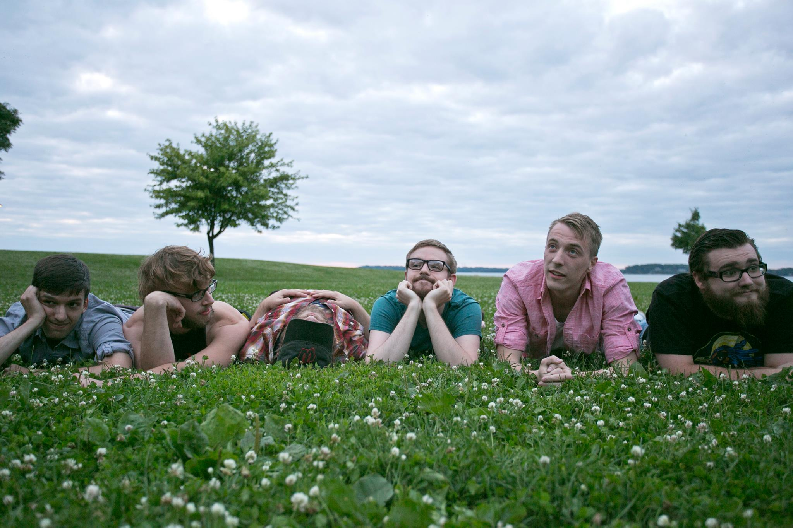
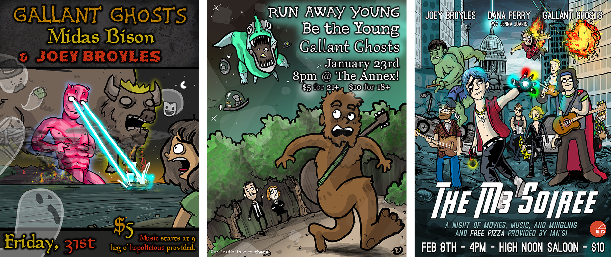
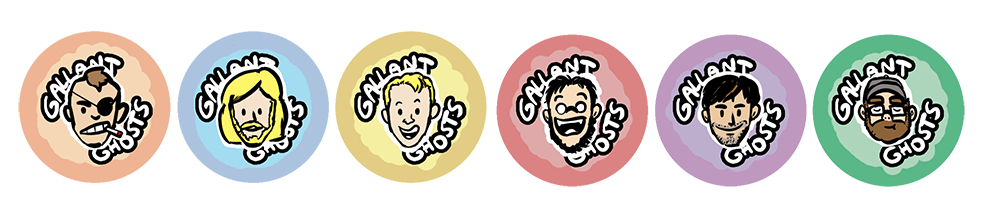
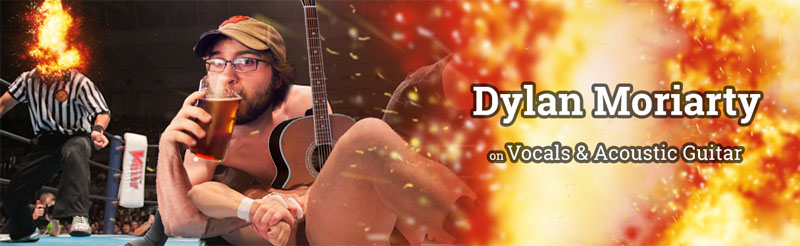
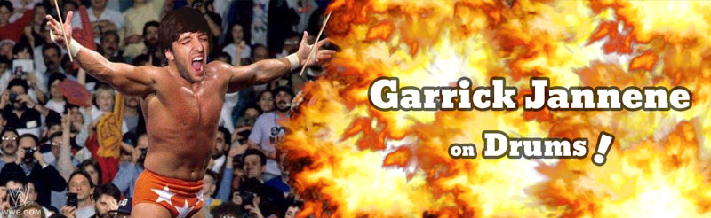
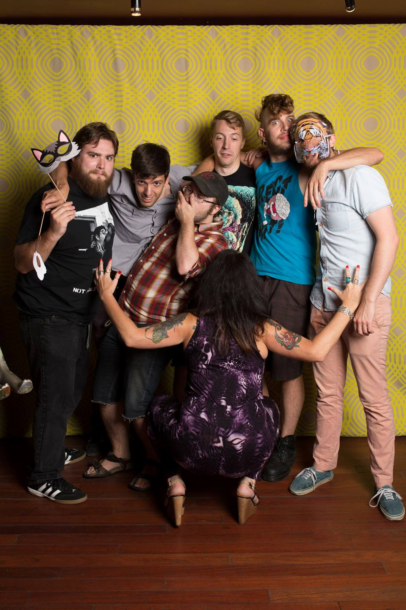

Recently my Facebook feed reminded me that around two years ago Gallant Ghosts played their first show. Being the sappy individual I am, it seemed appropriate to do a little retrospective on it and all the posters I made for our various shows.

TL;DR: It was great.

<iframe src="https://embed.spotify.com/?uri=spotify%3Auser%3Aeatincake%3Aplaylist%3A2pjcFWJo4mgvO6dwvui2NC" width="100%" height="300px" frameborder="0" allowtransparency="true"></iframe>

<fig>While I'd always recommend listening to tunes when browsing this site, for this post I really must insist.</fig>



We started Gallant Ghosts pretty much off a Facebook post from Connor asking if anyone wanted to start a band. Most of us had been in , so it was a lovely case of right time right place.

The name came out of a couple of weeks of brainstorming. Of all the ideas put out, it was the least groan-worthy, and we all agreed that "The Beatles" is a terrible band name so how much worse could we really do.



I did lil' posters for the bulk of our shows. They started out as pretty quick things, but later I found it a lot of fun to use this as an excuse to do some more elaborate doodles.



After bringing him to a few shows Wheels, my pet fake dog became our defacto mascot.

Where Wheels came from, no one can really say. I happened upon him thanks to my sister Eleanor who regularly spends two to three hours shopping at Good Will. Good Will is great, but the men's clothing section ain't that entertaining for that long. Myself and her husband were killing time enjoying all the various trinkets when we found Wheels. We immediately set to using it to terrify Eleanor by rolling him under the clothing racks at her, but he's such a darn unique item that we couldn't turn down  at the end of the day.

Many houses later, Wheels slowly accumulated an ascot, a crash helmet, & an appreciation of Hamm's beer.

We made some demos pretty early on to give to local organizers and up our credibility, and sold miscellaneous collections of those songs on burned cd's at our shows. As these were just scattered collections and not anything too thoughtful, most of these were labeled the night of, in the blank space between sound checks.

When it came to make a fancy EP release though, we pretty quickly settled on .



Between the social media accounts & everything there was a lot of room for _making a lot of stuff_.

First off, I made a series of song avatar's for use with our Soundcloud account.

I also got to make some merch! Buttons, stickers, & coozies galore. We never managed shirts, sadly enough.

...and to give our Facebook account some love I spent a few months rotating the banner image with these beauts:



I left the band after moving to DC, though they still chugged along for a good year. Gallant Ghosts continued on for a little over a year before splitting into different projects.

All in all, it was a blast running around with these dudes. Hosting house shows where crowd-surfing people dusted the basement ceiling with their backs, playing with [fantastic local artists](https://www.youtube.com/watch?v=dJK2cSvavGg) who genre wise we probably had no right being billed together with, & spending plenty of time getting lost in obscure Wisconsin back roads driving home was spectacular.

Here's to the ghost folks.

	

