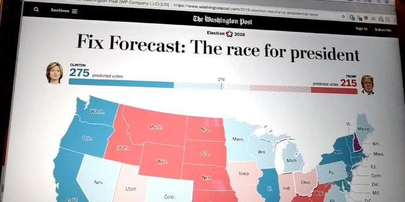
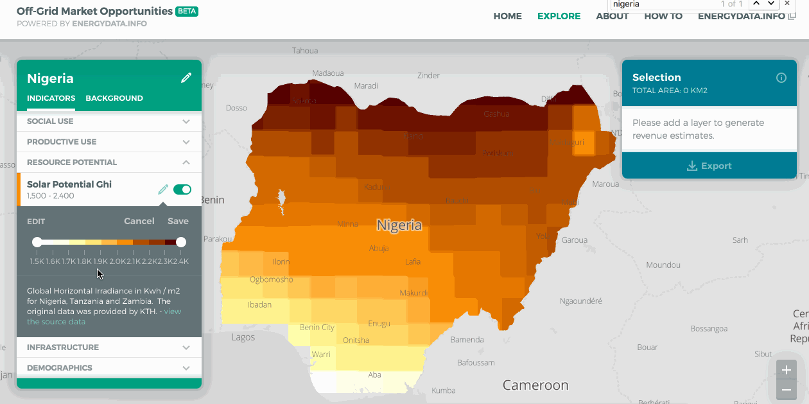
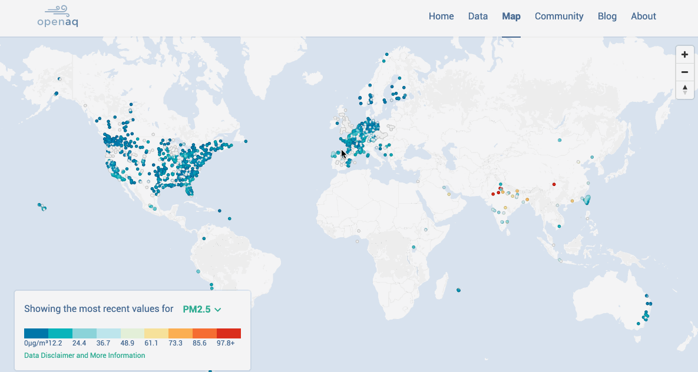
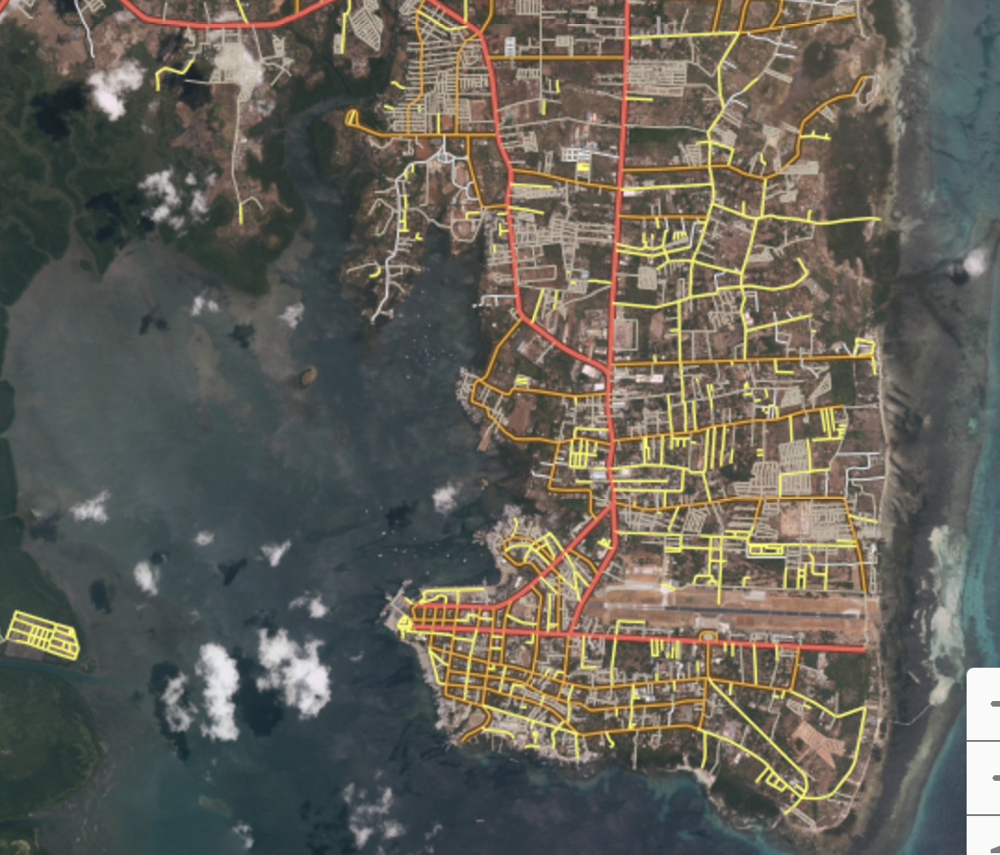
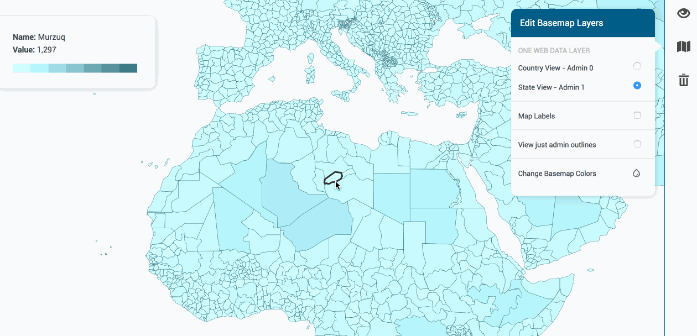
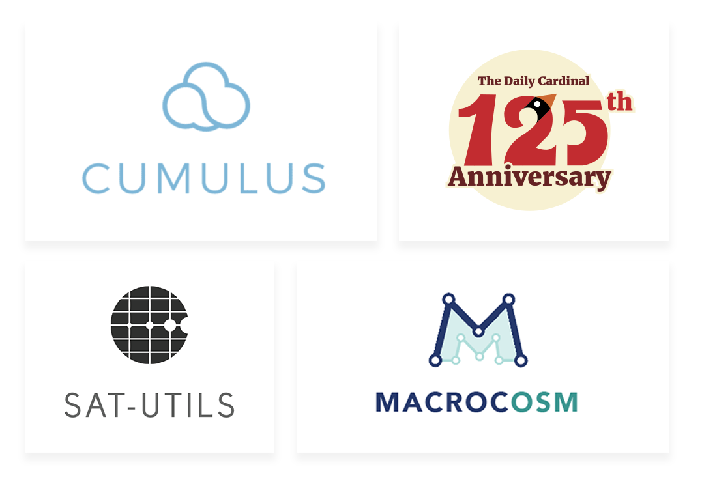
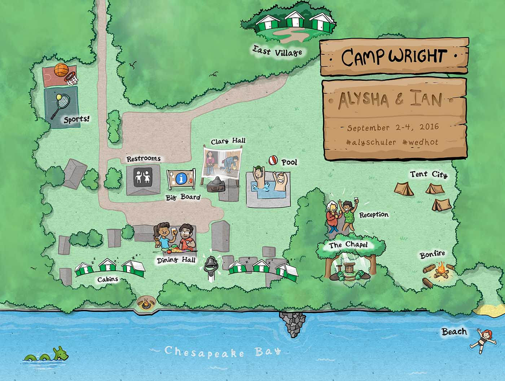
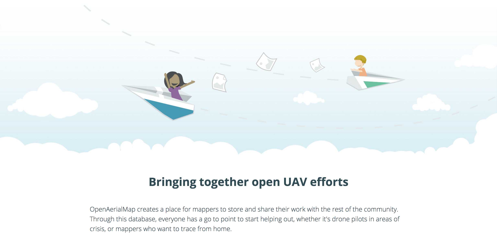
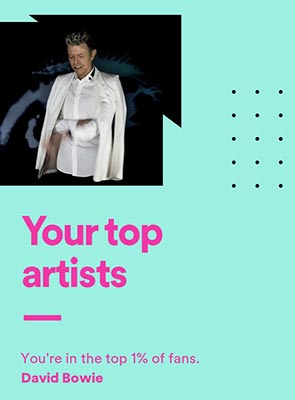

2016 was pretty incredible. I got to work on the Washington Post's Election Maps, made a logo for NASA, & dived further into deep waters of the open source humanitarian mapping community.

From July-October I kept a [digital scrapbook](https://dylanmoriarty.github.io/anno/) where you can see a lot of the sketches & in-progress work leading up to the following projects.



	<a href="https://www.washingtonpost.com/2016-election-results/us-presidential-race">
		

			<fig>Check it out!</fig>
		

	</a>

Devseed worked with the Washington Post to build out maps & the data pipeline for their 2016 election results maps. We built out the tools that took in data being constantly delivered from the Associated Press, digested that data, and piped them into the front facing maps.

My contribution to the project mostly revolved around the map itself- finding & cleaning up the geographic files, consulting on the map design, & translating the mockup styles into functional Mapbox GL JS. I also took some time to experiment with adding roads to the map, though we dropped it from the final version in favor of _ever so slightly_ faster maps.

For this project we needed to create projected shapefiles that would work in Mapbox GL JS, which only supports files in Mercator. We not only built out a tool to do that, but also released it for anyone to use & built out a fun wrapper website to show it off called "Dirty Reprojectors". You can read about the code on the [Devseed blog](https://developmentseed.org/blog/2016/12/15/dirty-reprojectors/)!

	<a href="https://devseed.com/dirty-reprojectors-app/">
		

			<fig>Front facing for Dirty Reprojectors, designed by moi.</fig>
		

	</a>

[Missing Maps](http://www.missingmaps.org/) was also officially launched at the start of the year! This joint venture with the Red Cross & the Humanitarian OpenStreetMap Team was the first major project I led design on, and it's been really neat to see it thrive since. I've written a bunch about it's development [elsewhere on this site](https://dylanmoriarty.github.io/blog/missing-maps.html).

Outside of those, I also helped create map styles for [OpenAQ](https://openaq.org/#/map), [OpenAerialMap](https://map.openaerialmap.org/#/?_k=sz9v83), & a bunch of World Bank projects. Here's a handful of highlights:

[Off-Grid Market Opportunities Explorer](http://offgrid.energydata.info/#/explore?_k=c60xxg), a tool for the World Bank to assess where to private investors should focus development based on various geospatial variables. The above image shows my favorite contribution: a combined legend & interactive filter for the data.

<a href="https://openaq.org/#/map">OpenAQ</a> is an open database for air quality information across the world. For this there was a lot of hoopla over what the color scheme would be for the points. We initially didn't want to use a diverging scheme because there isn't really a halfway _turning point_ where the amount of a mineral in the air makes it suddenly bad. We tried out a few other schemes, but the users sent a lot of feedback that they missed the red/blue dichotomy. Gotta go with what works for the users.

The above image shows road styling for [Open Roads](https://developmentseed.org/blog/2015/04/15/openstreetmap-for-government/), a custom OSM iD editor for the World Bank. Was a fun challenge figuring out how to make the same style look appropriate for both a satellite basemap & a very light one. We ended up making two different styles- one with a stronger casing so the roads pop on the sat imagery, and softer casing for the light version.

This was a small tool made to let the client more easily make maps showing off selections of their data via a webmap. They wanted to be able to make selections, get aggregates, and be able to control the color of the selections. This led to a pretty fun venture into experimenting with combining React with Mapbox GL. Data values have been scrubbed from the shown gif.



I also did a handful of logos & swag work.

	<fig>Logos for (in order): <a href="https://developmentseed.org/blog/2017/01/30/NASA-on-the-cloud/">Cumulus</a>- a cloud service for NASA's earth science data, <a href="http://www.dc125.us/">The Daily Cardinal 125th Anniversary</a>, <a href="https://github.com/sat-utils">SAT-UTILS</a>- open source utilities for processing satellite imagery, & <a href="https://developmentseed.org/blog/2016/05/16/macrocosm-easy/">MacrocOSM</a>- making a forks of OpenStreetMap API easier to use.</fig>

Development Seed goes to a quite a few conferences every year, so we enjoy having stylish shirts we can share with friends. I did a regular design that was just the flat logo on t-shirts, and also put together this:

	<fig>Notion here is Makeshift to the Moon! highlighting our general effective scrappiness.</fig>

I also had the honor of doing a bunch of graphics for Ian Schuler's camp ground wedding.

	<fig></fig>

This included some imagery for his wedding site properly titled 'Wed Hot American Summer', and a map of the camp that I hear was a big hit.

	<fig></fig>



	<fig></fig>

Almost everything I've done this year has in some way shape or form related to OpenStreetMap. As I've contributed more to the OSM ecosystem, I've also dived further into the organizations around it.

Quite a few projects we've done at Development Seed are through the Humanitarian OpenStreetMap Team. As of this year, I've officially [joined them as a voting member](https://www.hotosm.org/users/dylan_moriarty) to help make graphics for their communications.

	<fig>OpenAerialMap was one such project with HOT we did. I put together the homepage for it, and even managed to get a little illustrated bit towards the end.</fig>

I also managed to attend the 2016 HOT Summit & State of the Map conference in Brussels (pictured above). I gave [a talk at State of the Map](https://www.slideshare.net/DylanMoriarty/tracking-openstreetmap-contributions-in-real-time
) on the api behind the Missing Maps project, and while video exists of it the sounds messed up. Ah well. I gave the same talk to the North American Cartographic Information Society's conference shortly thereafter, & an additional one on [maps by hands](https://www.slideshare.net/DylanMoriarty/maps-by-hands).

Back in DC, after pestering them for enough times about it, I also joined MaptimeDC as an organizer. Looking to do exciting things for them!



	<fig>From Spotify's end of the year review of what you listened to.</fig>

RIP Bowie. Black Star was a spectacular swan song.



More work with OpenStreetMap, I'm sure. Hopefully more illustrations as well as more work around political engagement. I hope you'll stick around with me to see through 2017- It's gonna be good.
