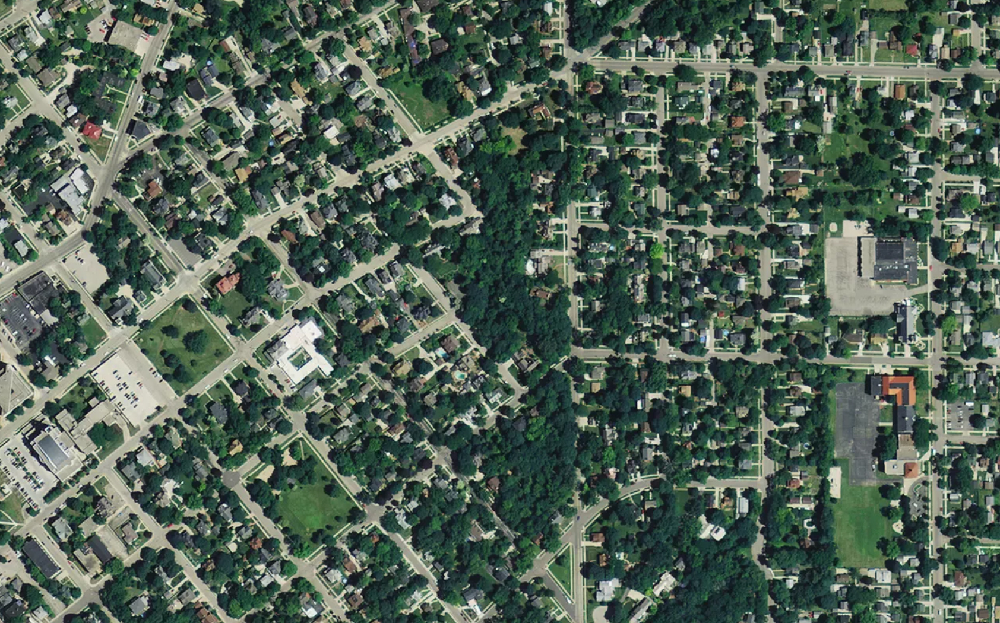
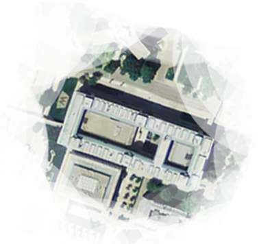

I spend a lot of time looking at maps. 

I think pretty much everyone nowadays does.

But every time I try to locate my hometown on a map with no labels I can hardly ever locate it. Each time I've gone back home, I'm struck by how different the mental maps I have of Janesville are compared to how things _actually_ are.

	

Above is a mental map of the route I would take to elementary school as a kid. Between the ages of 2~10 this was "the know world" to me. Sure, I knew there was an Olive Garden somewhere in the aether, but where it was relative to my home and how to get there were beyond me. Here's 1996 Janesville according to six year old Dylan:

	

Which goes a long way to explain why it's so incredibly strange to me looking at how Janesville is actually laid out. The in between was a foggy space. In actuality, my route to school looks like this:

	

Once we remove the fog crop, it's borderline unrecognizable to me as the same place.

	
	<fig><a href="https://www.youtube.com/watch?v=TGofoH9RDEA" target="_blank">This is not my beautiful house!</a></fig>

Which got me thinking about other spaces I vaguely knew. I would visit Madison Wisconsin fairly frequently, mostly because of my farmers market loving & proud alumni parents. The main commerce avenue, State Street, has been familiar to me pretty much all my life.

There was also one building where school competitions would frequent, I now know is the campus 
. The building _roughly_ looks the same on all sides, so I never really knew which direction I was looking out coming out of it. There were more than a few occasions where following folks to grab lunch I'd be amazed to discover how close it was to my 'known' world of State Street.

	
	

Now, two years I ago I moved to Washington DC, a geographic clean slate to my mental memory. But I've always had maps available, and have heavily used them. Every time I needed to get somewhere, I have a basemap to go off. Even if I'm not interested in seeing DC at large, opening an Uber app, looking up a dentist's office, or checking the rating of a local place all reinforce this map.

As such everything really just slots onto that basemap, like a puzzle piece. The overall context of where things are in relation to one another isn't a mystery and I'm always somewhat aware of how far away I am from everything else.

	

& that's probably a good thing. I've never really been lost in DC. I might not know if this or that street actually connect, but just seeing the Washington Monument I have a pretty perfect knowledge of where everything else is.

I suppose what strikes me about it is that my impression of DC is an aerial view, abstracted from anything I've really seen in person. For practical purposes, my mental map of Janesville was functionally flawless. But I can't kick the feeling that there was a lot more sense of discovery and revelation when after driving around multiple back roads we would surprisingly suddenly pop out next to a familiar area.

I kinda miss the discovery between foggy spaces.

	
All maps here were made using satellite imagery screenshot'd from <a href="mapbox.com" target="_blank">Mapbox</a>'s Satellite base layer. The Basemap used for DC is Mapbox Light style with the labels nixed.

	
This could also all just be the result of living in a city too, where a more prominent public transit system help reinforce the almighty basemap. Or maybe just getting older and being more aware of my surroundings in general. Regardless, I'm just thinking out loud here ;)

	
A lot of the islands in the fog seem to be food related. This is probably because 1) I omitted friends houses and more obscure places I didn't frequent & 2) Toys R' Us was great, but not a place we'd visit as often as, say, the .

