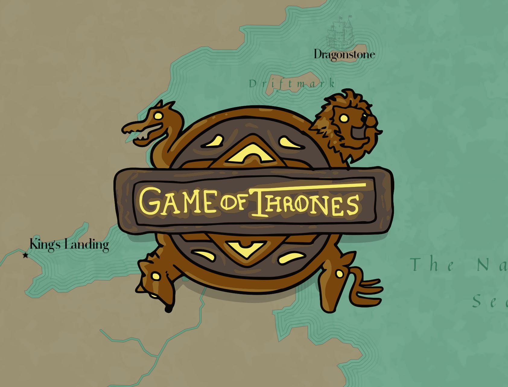

  

  

 



George R.R. Martin's Game of Thrones is a pretty fantastic story, and the density of the world building he put together for it is astounding. Every episode opens with zooming into different places in his world, & I thought it'd be fun to put together a version where you yourself could do that zoomin'.

Just before the new season dropped, I did a search to see if anyone had made  of the Game of Thrones world. Alas, some person going by the username Cadael had! You can check it out yourself <a href="https://www.cartographersguild.com/showthread.php?t=30472" target="_blank">here at the Cartographers Guild.</a> Bless ya'll fantasy mappers. From there, I edited those files in QGIS to generate some waterline layers & tweak the label points to better cooperate, & finally pulled it all into Mapbox to style.

Hope ya'll enjoy the map! There's seven little doodles based on events of this season that I've scattered on the map- to see them, you'll have to zoom in tight. Good luck!

  
  <figcaption>For anyone wondering, Westeros is actually just over Africa. The more you know~</figcaption>

